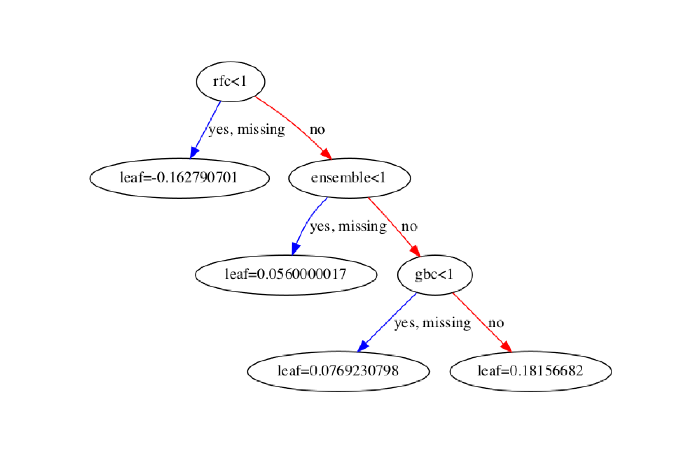

# Titanic: Machine Learning from Disaster
## General Approach
After many minutes of thought, I decided on a ensemble-model, mostly because I never used one. I used the Sklearn and the XBG-Boost package.
To tune the parameters, I used GridSearchCV with a standard 5-fold approach. I also used a test/train-split to see how my model is improving by tuning and adding models. This gave me a score of 0.773. However, I wanted to reach Top 10% (above ~0.8) without using any tricks (Like downloading a dictionary with the titanic-survivors).

## Final tuning to reach Top 10%
After having exhausted the ensemble-model, I turned to feature engineering. My first idea was that senior people will give up their seat in the life rafts and/or just not make it to safety, while children will be prioritized. This made me create age-categories.
I also guessed the missing age by connecting age to title. Master = Young boy, Miss = (probably) young woman, Mister = (probably) older man etc. based on the mean of the respective titles. I also made a new category for people with important titles.

## Result
The final tuning finally brought me above 0.8 accuracy (Final score: 0.80861 on Kaggle, 0.0.8324 on my Test-set). I created an ensemble model which was evaluated by XGBoost.

## TODO:
Improve Kaggle-Score. I don't want to "overfit" to the public leaderboard, but I also want a better score. Probably check out other kernels for smart feature engineering without creating information which couldn't be used on a "future titanic".

